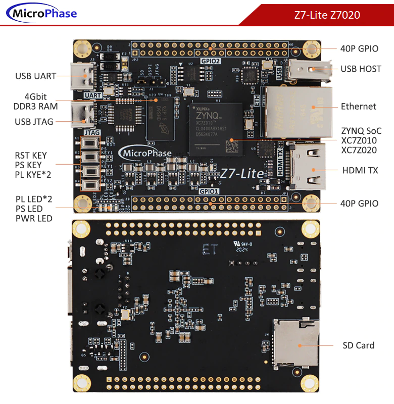

# MicroPhase Z7-Lite Board



The AMD Xilinx FPGA study with MicroPhase Z7-Lite.
<br><br>

## Setup

### Board Files Install

1. (**Optical**) Download git source and Copy the `board_files` directory to the following path in your Vivado installation.

    This doesn't not work in the lastest Vivado(2024.1), and is **not necessary**.

    ```bash
    [Vivado path]/[version]/data/board/
    ```

<br>

2. In Vivado, navigate to `[Tools] -> [Settings] -> [Vivado Store] -> [Board Repository]`. 

    Then, add the specified path.

<br><br>

## Examples

[[Github] examples](https://github.com/leecurrent04/MicroPhase-Z7-Lite-Board/tree/main/examples/vivado)

### 1. Basic logic 

- 0_test
- 1_logic_gate : Basic gates, and, or, not, xor
- 2_adder : 1 Bit full adder
- 3_7segment : 7-Segment Display

### 2. Zynq7000

- LAB 1 : Hello world on Zynq PS
- LAB 2 : Control PL's I/O(Buttons and LEDs) using PS with AXI

## Appendix

### A. Development HAT


Please refer to [the following for information on PCB design.](https://github.com/leecurrent04/MicroPhase-Z7-Lite-Board/tree/main/development_hat)

<br><br>
