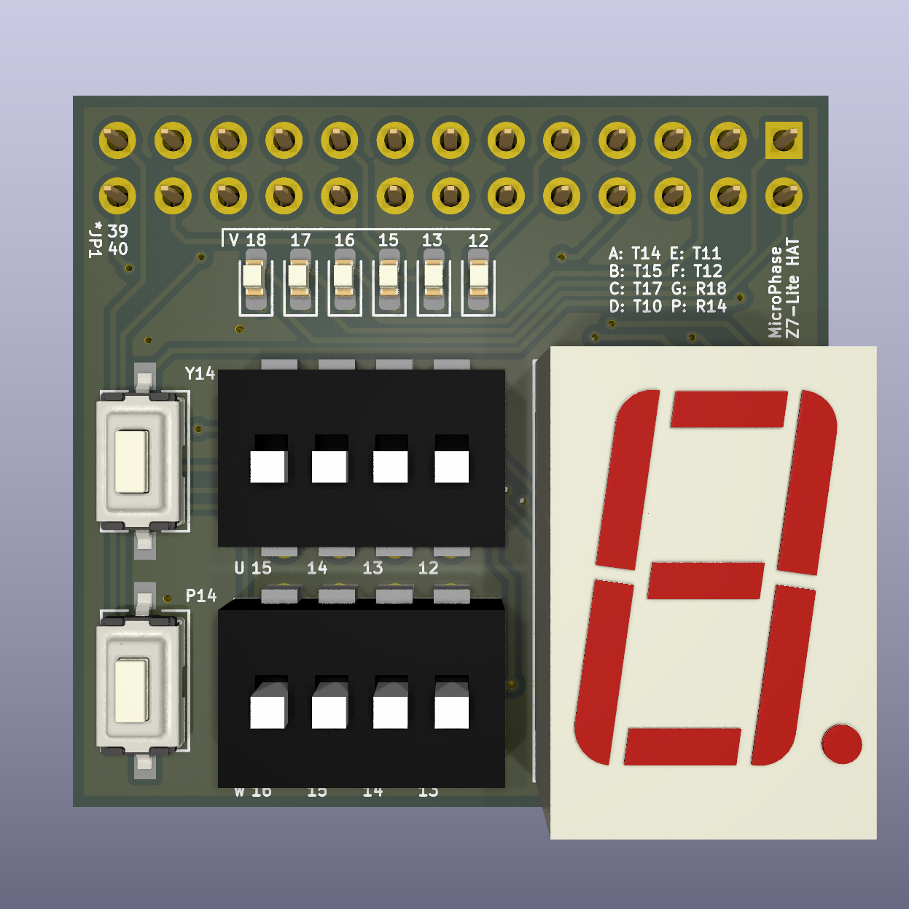

# MicroPhase Z7-Lite Board


The AMD Xilinx FPGA study with MicroPhase Z7-Lite.
<br><br>

## Setup

### Board Files Install

(Optical) 1. Download git source and Copy the `board_files` directory to the following path in your Vivado installation: 

```bash
[Vivado path]/[version]/data/board/
```

<br>

2. In Vivado, navigate to `[Tools] -> [Settings] -> [Vivado Store] -> [Board Repository]`. Then, add the specified path.
<br><br>

## Examples

[[Github] examples](https://github.com/leecurrent04/MicroPhase-Z7-Lite-Board/tree/main/examples/vivado)

- 0_test
- 1_logic_gate : Basic gates, and, or, not, xor
- 2_adder : 1 Bit full adder
- 3_7segment : 7-Segment Display

## Appendix

### A. Development HAT



Please refer to [the following for information on PCB design.](https://github.com/leecurrent04/MicroPhase-Z7-Lite-Board/tree/main/development_hat)
<br><br>
