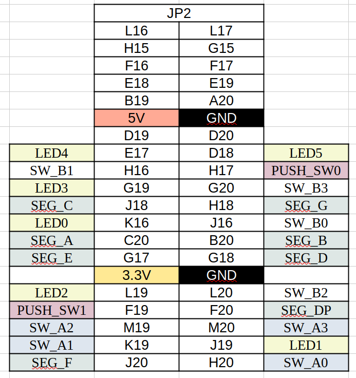

# Development HAT

The Development HAT for MicroPhase Z7-Lite Board. 
KiCAD verion is 8.0.2.
  

## Pin Map

When using the board at JP1, switch A1 doesn't work. This is because the U13 I/O pin is connected to a pull-down resistor (1kΩ), whereas this HAT works with a pull-up resistor (10kΩ). As a result, the voltage when it is not pressed (logic high) is 
$$V_{high} = \frac{1kΩ}{1kΩ+10kΩ} \cdot 3.3V = 0.3V < 2.65V$$
So it always input `LOW`. 

|  JP1  |  JP2  | Function |  JP1  |  JP2  | Function |
| :---: | :---: | :------: | :---: | :---: | :------: |
|  V12  |  K16  |   LED0   |  T14  |  C20  |  SEG_A   |
|  V13  |  J19  |   LED1   |  T15  |  B20  |  SEG_B   |
|  V15  |  L19  |   LED2   |  T17  |  J18  |  SEG_C   |
|  V16  |  G19  |   LED3   |  T10  |  G18  |  SEG_D   |
|  V17  |  E17  |   LED4   |  R14  |  F20  |  SEG_DP  |
|  V18  |  D18  |   LED5   |  T11  |  G17  |  SEG_E   |
|       |       |          |  T12  |  J20  |  SEG_F   |
|       |       |          |  R18  |  H18  |  SEG_G   |
|       |       |          |       |       |          |
|  U12  |  H20  |  SW_A0   |  W13  |  J16  |  SW_B0   |
|  U13  |  K19  |  SW_A1   |  W14  |  H16  |  SW_B1   |
|  U14  |  M19  |  SW_A2   |  W15  |  L20  |  SW_B2   |
|  U15  |  M20  |  SW_A3   |  W16  |  G20  |  SW_B3   |
|       |       |          |       |       |          |
|  Y14  |  H17  | PUSH_SW0 |  P14  |  F19  | PUSH_SW1 |

 

  

## Example with components

| Parts     |  Num  | Example                         |
| --------- | :---: | ------------------------------- |
| Push SW   |   2   | Basic Logic gate                |
| DIP SW 4  |   2   | 4bit Full Adder, 4bit Filp Flop |
| LED       |   6   | 4bit Full Adder                 |
| 7 Segment |   1   | BCD to 7 Segment Decoder        |

  

## BOM

| Name                                                                                                       | Num |
| ---------------------------------------------------------------------------------------------------------- | --- |
| [[OTAX] KSD-04H](https://www.devicemart.co.kr/goods/view?no=1778)                                          | 2   |
| [[영성정공] ITS-1163(SMD)](https://www.devicemart.co.kr/goods/view?no=2220)                                | 2   |
| [[TA-I] 칩저항 1608사이즈 F급 1KΩ](https://www.devicemart.co.kr/goods/view?no=6061)                        | 7   |
| [[TA-I] 칩저항 1608사이즈 F급 10KΩ](https://www.devicemart.co.kr/goods/view?no=1077779)                    | 10  |
| [[Nationstar] 칩LED 1608 빨강 [FC-DA1608HRK-620D]](https://www.devicemart.co.kr/goods/view?no=14047555)    | 6   |
| [[DAKWANG (중국)] 5101CSR](https://www.devicemart.co.kr/goods/view?no=11552)                               | 1   |
| [[CONNFLY (중국)] 핀헤더소켓 Dual 2x13 Straight(2.54mm)](https://www.devicemart.co.kr/goods/view?no=12527) | 1   |
