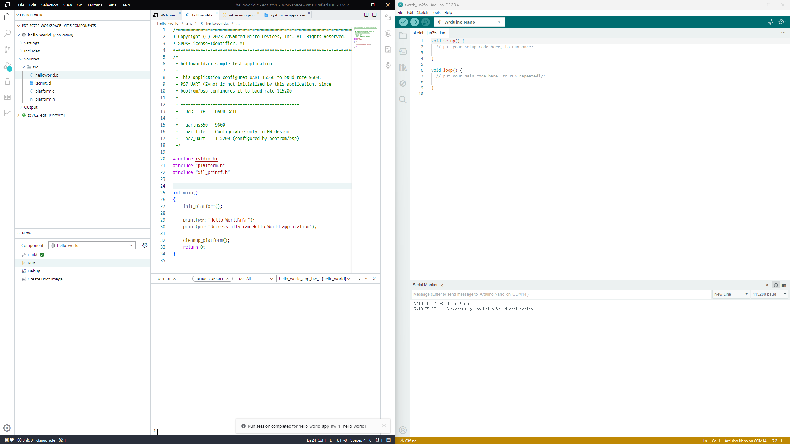

# LAB 1 : Hello world

[[Github] Using the Zynq SoC Processing System](https://github.com/Xilinx/Embedded-Design-Tutorials/blob/master/docs/Getting_Started/Zynq7000-EDT/2-using-zynq.rst)

## Vivado

### 1. IP INTEGATOR

**Creatre Block Design** -> **Add IP** -> **ZYNQ7 Processing System** -> **Run Block Automation**

### 2. Add UART 0

- UART 0 : MIO 14 - 15

**Customize Block** -> **MIO Configuration** -> **UART 0** Check.

### (Optical) Add M_AXI_GP0_ACLK 

**Customize Block** -> **PS-PL Configuration** -> **AXI Non Secure Enablement** -> **M AXI GP0 interface** Check.

## Vitis

