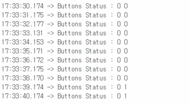
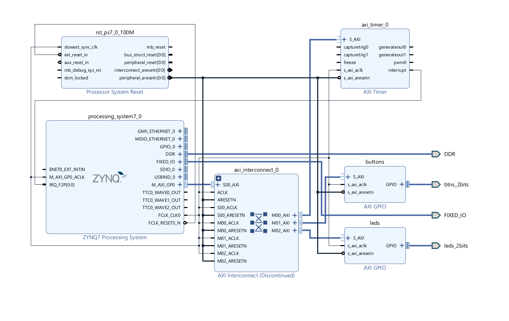

# LAB 2 : Control PL's I/O(Buttons and LEDs) using PS with AXI

[[Github] Using the GP Port in Zynq Devices](https://github.com/Xilinx/Embedded-Design-Tutorials/blob/master/docs/Getting_Started/Zynq7000-EDT/5-using-gp-port-zynq.rst)

PS에서 AXI를 이용하여 PL의 버튼이나 LED 제어하기

## Vivado

### 1) ZYNQ7 Processing System

1. Add the **ZYNQ7 Processing System IP**.

        Creatre Block Design -> Add IP -> ZYNQ7 Processing System

    And double-click the block to open the **Re-customize IP** dialog box.

    Set the **UART's IO** to MIO 14-15 for serial output and **SD 0's IO** to MIO 40-45 for boot.

2. Enable the **M AXI GP0 Interface**.

        PS-PL Configuration -> AXI Non Secure Enablement -> M AXI GP0 Interface

3. Enable the **GPIO EMIO**.

        Peripheral I/O Pins -> Peripherals -> GPIO EMIO

4. Chage the **EMIO GPIO (Width)** to **4**.
    
    LED 2, Button 2

        MIO Configuration -> I/O Peripherals -> GPIO -> EMIO GPIO (Width)

5. Enable the **FCLK_CLK0**.

        Clock Configuration -> PL Fabric Clocks -> FCLK_CLK0

6. Enable the interrupt, **IRQ_F2P[15:0]**.

        Interrupts -> Fabric Interrupts -> PL-PS Interrupt Ports -> IRQ_F2P[15:0]

### 2) AXI GPIO

### 3) AXI Interconnect

### 4) Processor System Reset

## Vitis

