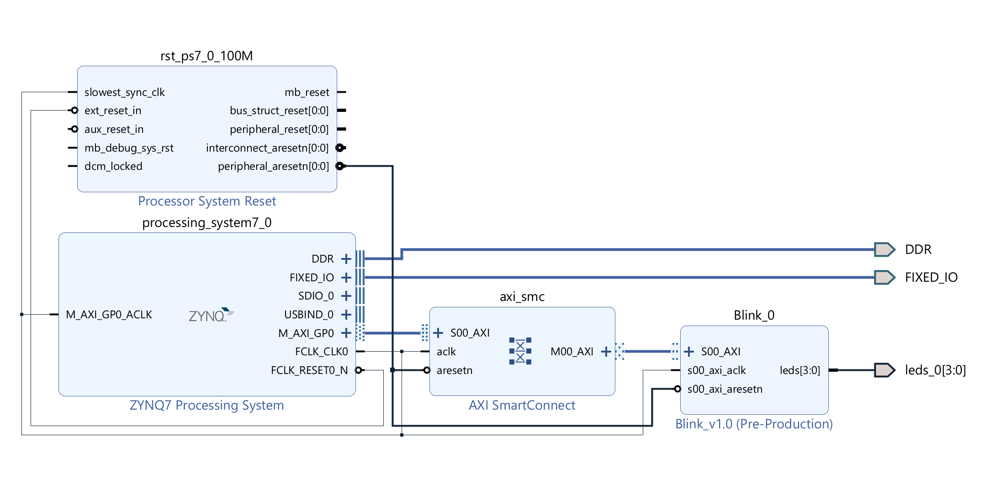

# LAB 3 : Custom IP

[[Github] Creating Custom IP and Device Drivers for Linux](https://github.com/Xilinx/Embedded-Design-Tutorials/blob/master/docs/Getting_Started/Zynq7000-EDT/8-custom-ip-driver-linux.rst)


AXI Clock에 따라 증가하는 28-bit Counter의 상위 4-bit를 LED로 출력하는 예제

## Vivado



### 1) create Custom ip as Blink

```verilog
always @( posedge S_AXI_ACLK )
begin
        //if reset is set, set count = 0x0
        if ( S_AXI_ARESETN == 1'b0 )
        begin
                count <= 28'b0;
        end
        else
        begin
                //when slv_reg_0 is set to 0x1, increment count
                if (slv_reg0 == 2'h01)
                begin
                        count <= count+1;
                end
                else
                begin
                        count <= count;
                end
end
```

## Vitis